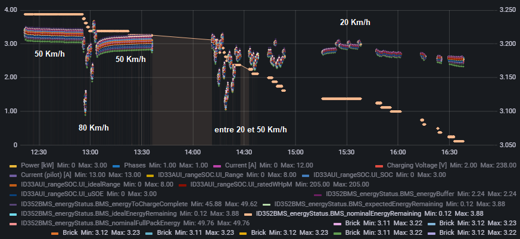
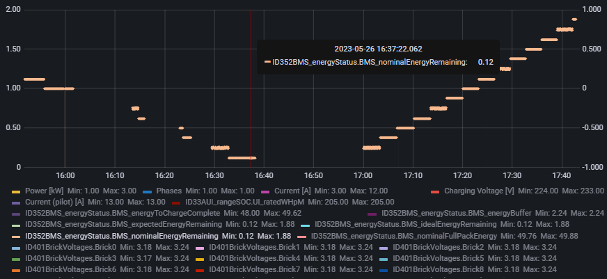
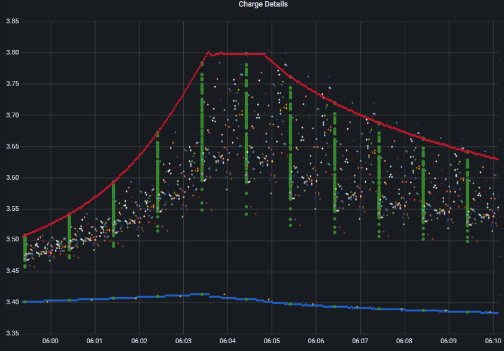
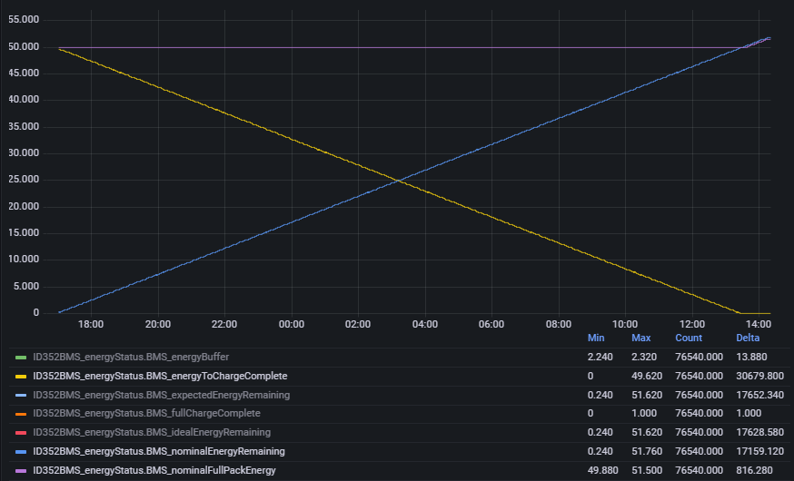
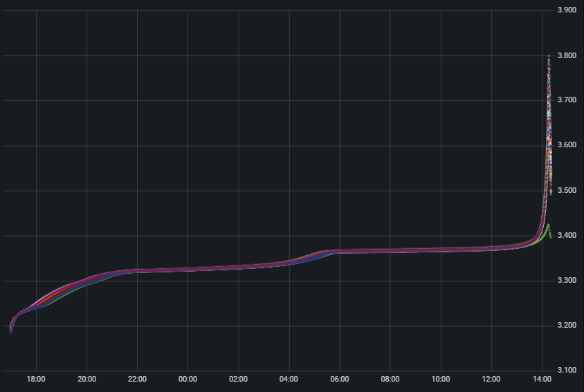
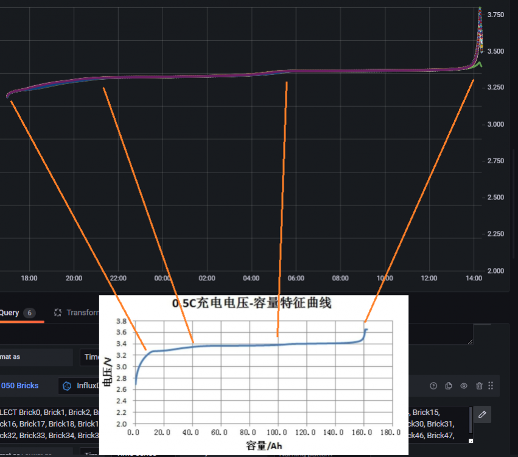

# ObdRecorder

This project attends to helps people to find out more informations about their vehicule by reading the CAN BUS from an OBD interface

I share my Tesla Model 3 CAN BUS data from a complete charge, from 0% to 100%. The recording contains voltages, currents of my battery pack and cells. BMS status, and so one...

I make this dump for it's 2 years anniversary, it is a sr+ chinese made, with a LFP chemistry and 55.1 kWh capacity when new  

For doing that, i bought a longan OBD-II CAN BUS :
https://www.longan-labs.cc/can-bus/obd-ii.html

And i write the software code to upload to this board. 
This code read CAN BUS messages and write them to a SD Card for post analysis
The code are located there : app/src/main/arduino

Once the data are written to SD Card, i made this application to parse the file and to export them in a influxDb for a grafana display

Example for printing my 100% recording charge :
https://github.com/jboll/ObdRecorder/blob/main/app/src/main/java/fr/jboll/obdrecorder/PrintRecordingDataInConsoleLauncher.java

Exemple for exporting this data into influxDb :
https://github.com/jboll/ObdRecorder/blob/main/app/src/main/java/fr/jboll/obdrecorder/TransferRecordingDataToDatabasePersistenceLauncher.java

Examples of grafana graphics :

From 3% to 0% SOC

Battery falling to 0 kWh, vehicule falling sleep, then recharging :

End of charge, at 100% SOC :

BMS status :

Cells voltage from my complete charging :

Cells voltage vs manufacture specification : 

CATL Spec :
https://forums.automobile-propre.com/applications/core/interface/file/attachment.php?id=118349&key=91e5d524870824781cda01ecc363e75f

For further informations :
https://forums.automobile-propre.com/topic/obd-ii-diy-retours-dexp%C3%A9rience-sur-un-sniffeur-de-bus-can-53043/#comments
https://forums.automobile-propre.com/topic/analyses-d%C3%A9taill%C3%A9es-des-donn%C3%A9es-circulant-sur-le-bus-can-pour-les-tm3-sr-lfp55-53521/?do=findComment&comment=1386312

